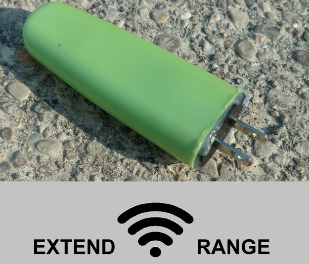

# Maker Saga DIY Projects & Tutorials

## Makeshift Wave Powered Cooling Mat

[Tutorial](http://www.instructables.com/id/Makeshift-Wave-Powered-Cooling-Mat/)

## Broken Drone Hardware Hack

[Tutorial](https://www.instructables.com/id/Broken-Toy-Drone-Hardware-Hack/)

## Cheap Music Reactive Laser Light Show

[Tutorial](https://www.instructables.com/id/Cheap-Music-Reactive-Light-Show/)

## Instructable Views Announcer Bot

[Tutorial](http://www.instructables.com/id/Instructable-Hit-Announcer-Bot/)
[Files](ViewBot.zip.zip)

## Versatile NearBot Platform

[Tutorial](http://www.instructables.com/id/Versatile-NearBot/)
[Files](ProxAct.zip.zip)

## Cheap WiFi Range Extender for IoT

[Tutorial](http://www.instructables.com/id/Cheap-WiFi-Range-Extender-for-IoT/)
[Files](ESP8266Extend.zip.zip)

## Snail Mail Notifier

[Files](ESP8266Notifier.zip.zip)

## Glider Dropping Mechanism for Drones

[Tutorial](https://www.instructables.com/id/Launch-a-Glider-Via-Quadcopter)
[Files](GliderTemplate.pdf)

## Python Email Sender App

[Tutorial](http://www.instructables.com/id/Send-Email-Using-Python/)

## Magical Monocle & Invisible Screen

[Tutorial](http://www.instructables.com/id/Magical-Monocle-Invisible-Screen/)

[Tip Jar](https://www.paypal.me/dmagryta124/2)
